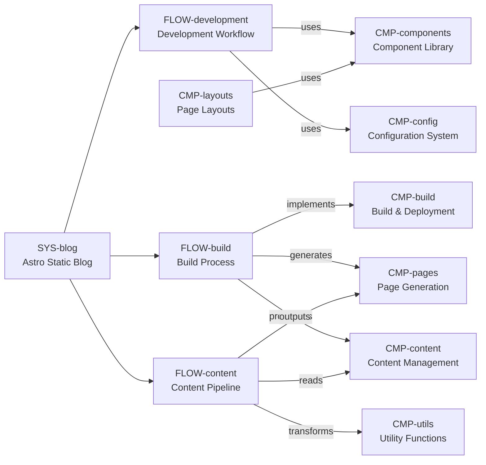

# LOGIC_MAP (Project Logic Map)

This file is the project-specific instance of `docs/LOGIC_SCHEMA.md`.
It is both:

- a prompt for agents (task → nodes → anchors → code)
- a logic-first README for humans (Mermaid + graph + invariants)

## How to use (agents)

1. Convert the user request into one or more candidate nodes:
   - `FLOW-*` if it is behavior/time-ordered
   - `CMP-*` if it is a module/subsystem
   - `INV-*` if it is a rule/constraint
2. Traverse `relations` to find adjacent nodes.
3. Follow `anchors` / `refs` into code/tests/config.
4. If the map is insufficient, improve the map (add anchors/edges) before broad scanning.

## How to read (humans)

1. Mermaid (if present)
2. `system` (what it is)
3. `flows` (how it behaves)
4. `components` (what owns responsibilities)
5. `relations` (how the pieces connect)

## Mermaid View



```yaml
system:
  id: SYS-blog
  title: Astro Static Blog
  purpose: "Generate a static website with blog functionality using Astro framework and AstroPaper theme."
  languages:
    - typescript
    - javascript
    - markdown
  entrypoints:
    - kind: command
      target: "pnpm dev"
      why: "Starts development server at localhost:4321"
    - kind: command
      target: "pnpm build"
      why: "Production build with type checking and search index generation"
    - kind: code
      target: src/pages/index.astro
      why: "Homepage entry point"
    - kind: code
      target: src/pages/posts/[...page].astro
      why: "Blog listing pages"
  key_configs:
    - kind: config
      target: astro.config.ts
      why: "Astro framework configuration with plugins and integrations"
    - kind: config
      target: src/config.ts
      why: "Site metadata, URLs, pagination, and feature toggles"
    - kind: config
      target: src/content.config.ts
      why: "Content collection schema with Zod validation"
    - kind: config
      target: package.json
      why: "Dependencies, scripts, and project metadata"

components:
  - id: CMP-content
    title: Content Management
    purpose: "Store and validate blog posts as Markdown files with frontmatter; manage content collections."
    anchors:
      - kind: file
        target: src/data/blog/
        why: "Directory containing all blog posts as Markdown files"
      - kind: code
        target: src/content.config.ts
        why: "Zod schema for blog post frontmatter validation"
      - kind: code
        target: src/content.config.ts#blog
        why: "Content collection definition with schema"
      - kind: code
        target: src/content.config.ts#blog.schema
        why: "Frontmatter validation rules (author, pubDatetime, tags, etc.)"

  - id: CMP-pages
    title: Page Generation
    purpose: "Define static routes and generate HTML pages; handle dynamic routes for posts, tags, archives."
    anchors:
      - kind: file
        target: src/pages/
        why: "Directory containing all page definitions"
      - kind: code
        target: src/pages/index.astro
        why: "Homepage with featured posts and pagination"
      - kind: code
        target: src/pages/posts/[...page].astro
        why: "Blog listing with pagination"
      - kind: code
        target: src/pages/posts/[...slug]/index.astro
        why: "Individual blog post pages"
      - kind: code
        target: src/pages/rss.xml.ts
        why: "RSS feed generation"
      - kind: code
        target: src/pages/og.png.ts
        why: "Default OG image generation"
      - kind: code
        target: src/pages/posts/[...slug]/index.png.ts
        why: "Dynamic OG image generation per post"

  - id: CMP-components
    title: Component Library
    purpose: "Provide reusable UI components for consistent blog layout and functionality."
    anchors:
      - kind: file
        target: src/components/
        why: "Directory containing all reusable components"
      - kind: code
        target: src/components/Card.astro
        why: "Post card component used in listings"
      - kind: code
        target: src/components/Header.astro
        why: "Site header with navigation"
      - kind: code
        target: src/components/Socials.astro
        why: "Social media links and share buttons"
      - kind: code
        target: src/components/Search.astro
        why: "Client-side search interface"
      - kind: code
        target: src/components/LanguageSwitcher.astro
        why: "Language switcher button for bilingual posts"

  - id: CMP-utils
    title: Utility Functions
    purpose: "Provide helper functions for post filtering, sorting, tag management, and OG image generation."
    anchors:
      - kind: file
        target: src/utils/
        why: "Directory containing utility functions"
      - kind: code
        target: src/utils/getSortedPosts.ts
        why: "Filter and sort blog posts by date"
      - kind: code
        target: src/utils/postFilter.ts
        why: "Filter logic for drafts and scheduled posts"
      - kind: code
        target: src/utils/getPostsByTag.ts
        why: "Get posts filtered by tag"
      - kind: code
        target: src/utils/getUniqueTags.ts
        why: "Extract unique tags from all posts"
      - kind: code
        target: src/utils/generateOgImages.ts
        why: "OG image generation using Satori and Resvg"

  - id: CMP-layouts
    title: Page Layouts
    purpose: "Define page layouts for different content types with consistent structure."
    anchors:
      - kind: file
        target: src/layouts/
        why: "Directory containing all layout definitions"
      - kind: code
        target: src/layouts/Layout.astro
        why: "Base layout with head, meta tags, and global structure"
      - kind: code
        target: src/layouts/PostDetails.astro
        why: "Individual blog post layout"
      - kind: code
        target: src/layouts/Main.astro
        why: "Main content layout wrapper"

  - id: CMP-config
    title: Configuration System
    purpose: "Define site metadata, constants, and framework configuration."
    anchors:
      - kind: code
        target: src/config.ts
        why: "Central site configuration (title, author, URLs, features)"
      - kind: code
        target: src/constants.ts
        why: "Social media links and share button configurations"
      - kind: code
        target: astro.config.ts
        why: "Astro framework configuration with plugins"
      - kind: code
        target: tailwind.config.mjs
        why: "Tailwind CSS v4 configuration"

  - id: CMP-build
    title: Build & Deployment
    purpose: "Handle production build process, search index generation, and deployment configurations."
    anchors:
      - kind: code
        target: package.json#scripts
        why: "Build and development scripts"
      - kind: file
        target: Dockerfile
        why: "Multi-stage Docker build for production"
      - kind: file
        target: docker-compose.yml
        why: "Docker development configuration"
      - kind: file
        target: .github/workflows/ci.yml
        why: "GitHub Actions CI/CD pipeline"
      - kind: code
        target: package.json#scripts.build
        why: "Build command with type checking and search index"

flows:
  - id: FLOW-development
    title: Development Workflow
    intent: "Local development with hot reload, content creation, and code quality checks."
    steps:
      - do: "Start development server"
        refs:
          - kind: command
            target: "pnpm dev"
            why: "Starts server at localhost:4321 with hot reload"
      - do: "Create/edit blog posts"
        refs:
          - kind: file
            target: src/data/blog/
            why: "Add Markdown files with frontmatter"
      - do: "Run code quality checks"
        refs:
          - kind: command
            target: "pnpm lint"
            why: "ESLint checks"
          - kind: command
            target: "pnpm format:check"
            why: "Prettier formatting check"
      - do: "Preview production build"
        refs:
          - kind: command
            target: "pnpm preview"
            why: "Serve production build locally"

  - id: FLOW-build
    title: Build Process
    intent: "Generate production-ready static site with type checking, search index, and optimized assets."
    steps:
      - do: "Type checking"
        refs:
          - kind: code
            target: package.json#scripts.build
            why: "Includes 'astro check' for TypeScript validation"
      - do: "Static site generation"
        refs:
          - kind: code
            target: astro.config.ts
            why: "Astro build configuration"
          - kind: code
            target: package.json#scripts.build
            why: "Runs 'astro build'"
      - do: "Search index generation"
        refs:
          - kind: code
            target: package.json#scripts.build
            why: "Runs 'pagefind --site dist' after build"
      - do: "Copy search index to public"
        refs:
          - kind: code
            target: package.json#scripts.build
            why: "Copies pagefind from dist to public directory"

  - id: FLOW-content
    title: Content Pipeline
    intent: "Process Markdown content into published blog posts with proper filtering and sorting."
    steps:
      - do: "Load content collection"
        refs:
          - kind: code
            target: src/content.config.ts
            why: "Zod schema validates frontmatter"
      - do: "Filter drafts and scheduled posts"
        refs:
          - kind: code
            target: src/utils/postFilter.ts
            why: "Removes draft posts and future-dated posts"
      - do: "Sort by publication date"
        refs:
          - kind: code
            target: src/utils/getSortedPosts.ts
            why: "Sorts posts by pubDatetime (newest first)"
      - do: "Generate pages"
        refs:
          - kind: code
            target: src/pages/posts/[...page].astro
            why: "Blog listing pages"
          - kind: code
            target: src/pages/posts/[...slug]/index.astro
            why: "Individual post pages"
      - do: "Generate OG images"
        refs:
          - kind: code
            target: src/pages/posts/[...slug]/index.png.ts
            why: "Dynamic OG image per post"
          - kind: code
            target: src/utils/generateOgImages.ts
            why: "OG image generation utility"

invariants:
  - id: INV-static-generation
    statement: "All pages must be statically generated at build time; no server-side rendering."
    refs:
      - kind: code
        target: astro.config.ts
        why: "Astro configured for static output"
      - kind: code
        target: package.json#scripts.build
        why: "Build produces static files in dist/"

  - id: INV-content-schema
    statement: "Blog posts must conform to the frontmatter schema defined in content.config.ts."
    refs:
      - kind: code
        target: src/content.config.ts#blog.schema
        why: "Zod validation schema for frontmatter"
      - kind: code
        target: src/utils/postFilter.ts
        why: "Filter depends on schema fields"

  - id: INV-draft-filtering
    statement: "Draft posts (draft: true) must be excluded from production builds."
    refs:
      - kind: code
        target: src/utils/postFilter.ts
        why: "Filters out posts where draft === true"
      - kind: code
        target: src/utils/getSortedPosts.ts
        why: "Uses postFilter for production sorting"

  - id: INV-scheduled-posts
    statement: "Posts with future pubDatetime must be filtered until their scheduled time."
    refs:
      - kind: code
        target: src/utils/postFilter.ts
        why: "Filters out posts where pubDatetime > now"
      - kind: code
        target: src/utils/getSortedPosts.ts
        why: "Uses postFilter which checks pubDatetime"

  - id: INV-search-index
    statement: "Pagefind search index must be generated during build and copied to public/."
    refs:
      - kind: code
        target: package.json#scripts.build
        why: "Includes pagefind generation and copy commands"
      - kind: file
        target: public/pagefind/
        why: "Search index location after build"

  - id: INV-pnpm-only
    statement: "Package management must use pnpm (not npm or yarn)."
    refs:
      - kind: file
        target: package.json
        why: "Uses pnpm-specific features and scripts"
      - kind: file
        target: pnpm-lock.yaml
        why: "pnpm lock file"

evidences:
  - id: EVD-type-checking
    title: "Type checking in build"
    refs:
      - kind: code
        target: package.json#scripts.build
        why: "Build script includes 'astro check' for TypeScript validation"
      - kind: file
        target: .github/workflows/ci.yml
        why: "CI pipeline runs type checking"

  - id: EVD-draft-filter-test
    title: "Draft filtering evidence"
    refs:
      - kind: code
        target: src/utils/postFilter.ts
        why: "Explicit check for draft === true"
      - kind: code
        target: src/utils/getSortedPosts.ts
        why: "Uses postFilter which filters drafts"

relations:
  - id: REL-dev-uses-components
    from: FLOW-development
    to: CMP-components
    kind: uses
    note: "Development workflow uses component library for UI"
    refs:
      - kind: code
        target: src/pages/index.astro
        why: "Uses Card, Header, Socials components"
      - kind: code
        target: src/pages/posts/[...slug]/index.astro
        why: "Uses components for post layout"

  - id: REL-dev-uses-config
    from: FLOW-development
    to: CMP-config
    kind: uses
    note: "Development depends on configuration for site behavior"
    refs:
      - kind: code
        target: src/config.ts
        why: "Site metadata used throughout development"
      - kind: code
        target: astro.config.ts
        why: "Framework configuration for dev server"

  - id: REL-build-implements-build-system
    from: FLOW-build
    to: CMP-build
    kind: implements
    note: "Build flow is implemented by build system components"
    refs:
      - kind: code
        target: package.json#scripts.build
        why: "Build script defines the flow"
      - kind: file
        target: Dockerfile
        why: "Docker build implements production build"

  - id: REL-build-generates-pages
    from: FLOW-build
    to: CMP-pages
    kind: generates
    note: "Build process generates static pages"
    refs:
      - kind: code
        target: package.json#scripts.build
        why: "Build includes astro build which generates pages"
      - kind: file
        target: dist/
        why: "Output directory for generated pages"

  - id: REL-build-processes-content
    from: FLOW-build
    to: CMP-content
    kind: processes
    note: "Build processes content through validation and filtering"
    refs:
      - kind: code
        target: src/content.config.ts
        why: "Content validation during build"
      - kind: code
        target: src/utils/postFilter.ts
        why: "Content filtering during build"

  - id: REL-content-reads-content
    from: FLOW-content
    to: CMP-content
    kind: reads
    note: "Content pipeline reads from content management system"
    refs:
      - kind: code
        target: src/utils/getSortedPosts.ts
        why: "Reads content collection"
      - kind: code
        target: src/pages/posts/[...page].astro
        why: "Queries content collection"

  - id: REL-content-transforms-utils
    from: FLOW-content
    to: CMP-utils
    kind: transforms
    note: "Content pipeline uses utilities for filtering, sorting, and transformation"
    refs:
      - kind: code
        target: src/utils/postFilter.ts
        why: "Filters drafts and scheduled posts"
      - kind: code
        target: src/utils/getSortedPosts.ts
        why: "Sorts posts by date"

  - id: REL-content-outputs-pages
    from: FLOW-content
    to: CMP-pages
    kind: outputs
    note: "Content pipeline outputs to page generation system"
    refs:
      - kind: code
        target: src/pages/posts/[...page].astro
        why: "Outputs blog listing pages"
      - kind: code
        target: src/pages/posts/[...slug]/index.astro
        why: "Outputs individual post pages"

  - id: REL-inv-static-constrains-build
    from: INV-static-generation
    to: CMP-build
    kind: constrains
    note: "Static generation invariant constrains build system"
    refs:
      - kind: code
        target: astro.config.ts
        why: "Config must output static files"
      - kind: code
        target: package.json#scripts.build
        why: "Build must produce static output"

  - id: REL-inv-schema-constrains-content
    from: INV-content-schema
    to: CMP-content
    kind: constrains
    note: "Content schema invariant constrains content management"
    refs:
      - kind: code
        target: src/content.config.ts#blog.schema
        why: "Defines required frontmatter structure"
      - kind: code
        target: src/utils/postFilter.ts
        why: "Depends on schema fields"

  - id: REL-inv-draft-constrains-utils
    from: INV-draft-filtering
    to: CMP-utils
    kind: constrains
    note: "Draft filtering invariant constrains utility functions"
    refs:
      - kind: code
        target: src/utils/postFilter.ts
        why: "Must filter draft posts"
      - kind: code
        target: src/utils/getSortedPosts.ts
        why: "Must use postFilter which filters drafts"

  - id: REL-inv-pnpm-constrains-build
    from: INV-pnpm-only
    to: CMP-build
    kind: constrains
    note: "pnpm-only invariant constrains build system"
    refs:
      - kind: file
        target: package.json
        why: "Must use pnpm scripts"
      - kind: file
        target: pnpm-lock.yaml
        why: "Must have pnpm lock file"

  - id: REL-evd-type-checking-evidence-build
    from: EVD-type-checking
    to: CMP-build
    kind: evidences
    note: "Type checking evidence supports build system"
    refs:
      - kind: code
        target: package.json#scripts.build
        why: "Build includes type checking"
      - kind: file
        target: .github/workflows/ci.yml
        why: "CI enforces type checking"

  - id: REL-evd-draft-filter-evidence-utils
    from: EVD-draft-filter-test
    to: CMP-utils
    kind: evidences
    note: "Draft filter evidence supports utility functions"
    refs:
      - kind: code
        target: src/utils/postFilter.ts
        why: "Explicit draft filtering"
      - kind: code
        target: src/utils/getSortedPosts.ts
        why: "Uses postFilter"

  - id: REL-layouts-uses-components
    from: CMP-layouts
    to: CMP-components
    kind: uses
    note: "Page layouts use reusable components"
    refs:
      - kind: code
        target: src/layouts/PostDetails.astro
        why: "Uses Header, Footer, Tag, LanguageSwitcher, etc."
```

## Maintenance

- Keep `id`s stable.
- Prefer `file#SymbolPath` anchors (line numbers are volatile).
- When behavior changes, update the nearest `FLOW-*` steps and the affected `relations`.
- When adding a new invariant, add at least one evidence ref when possible (test/assert/log).
- Update this map when:
  - Adding new content types or changing content schema
  - Modifying build process or deployment configuration
  - Adding new pages or components
  - Changing site configuration or constants
- This map should be updated as part of the "done" criteria for significant changes to the codebase.